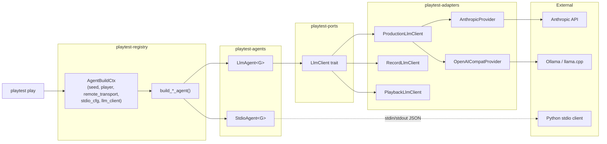
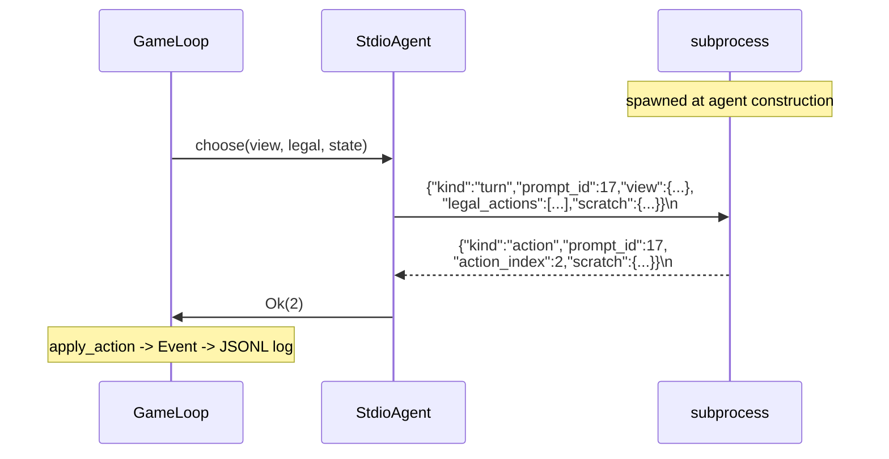

# feat: stdio agent protocol + LLM agent (Phase 3)

## Overview

Phase 3 opens the engine to two new classes of decision-maker: external processes speaking a stable JSON-over-stdio protocol, and in-Rust LLM-backed agents calling Anthropic (or an OpenAI-compatible local endpoint) with prompt caching. Both are siblings of Phase 2.5's HTTP remote agent — same async `Agent` trait, same `AgentBuildCtx` plug-in point, same event-log invariants.

The plan carves out the minimum viable slice per `playtest-roadmap.md:69-85`: a `stdio` agent kind with a working Python reference client, an `llm` agent kind that plays a full Cribbage game against Anthropic Haiku for under $0.20, and a local-model path (Ollama / llama.cpp) behind the same `LlmClient` port. Personas (Phase 4), post-game critique (Phase 5), and comparative analysis (Phase 6) remain out of scope and are called out explicitly below.

## Problem Frame

The engine today can be driven by in-process agents only (Random, Scripted, Greedy, Heuristic, ISMCTS) and, since Phase 2.5, by browser tabs submitting HTTP. Two capability gaps remain before Phase 4+ work is possible:

1. **No external-process agent path.** LLM scaffolding tools, experimental Python agents, CFR harnesses (Phase 9b), and the TTS bridge (Phase 9e) all want a stable subprocess contract to plug into — the same shape Slay the Spire's CommunicationMod established. Without it, every new external driver forks the engine or writes a new HTTP client.
2. **No in-Rust LLM agent.** The `LlmClient` port exists with four adapters, but its `production` variant returns `NotConfigured` (see `crates/playtest-ports/src/llm_client.rs:17`). There is no agent that consumes it and no cost story. The Phase 3 exit criterion — Haiku plays a legal game end-to-end for under $0.20 with scratch-buffer updates — has no implementation attached today.

Fixing both in one plan preserves the roadmap's original sequencing and lets the prompt-caching / token-accounting work benefit both paths: the stdio agent's Python client can host the same LLM from outside, and the in-Rust `LlmAgent` can share provider code with record/playback tests.

## Requirements Trace

Drawn from `playtest-roadmap.md` Phase 3 and the architectural invariants in `CLAUDE.md`.

- **R3.1** A new agent kind `stdio` is accepted by `build_cribbage_agent` / `build_shipwreck_agent`. It spawns a configured subprocess at construction, communicates via line-delimited JSON on the child's stdin/stdout, and treats the child's `action_index` response as the normal return value from `choose`.
- **R3.2** A new agent kind `llm:provider=<p>,model=<m>[,...]` is accepted by both game factories. It consumes `Arc<dyn LlmClient>` from `AgentBuildCtx`, builds a model-aware prompt containing game rules + public view + legal actions + scratch buffer, and parses the model's reply into an action index plus updated scratch buffer.
- **R3.3** The `LlmClient` port's request shape extends to message-based chat plus explicit `cache_control` on system blocks. The response shape carries `cache_read_input_tokens` and `cache_creation_input_tokens`. Stub / record / playback adapters are updated symmetrically — no adapter left behind.
- **R3.4** A production `LlmClient` adapter lands with two providers behind a single internal `Provider` trait: Anthropic (for `claude-*` models; applies `cache_control`) and OpenAI-compatible (for Ollama / llama.cpp; ignores `cache_control` without error).
- **R3.5** Cost guardrails: per-game token-budget cap enforced inside the port adapter (returns `LlmError::BudgetExceeded`); `--model`, `--llm-provider`, `--llm-budget-tokens` flags on `playtest play`; sidecar log file `<run>/games/<gid>.llm.jsonl` records every LLM call with model, input/output/cache tokens, and latency.
- **R3.6** The main JSONL event log (schema v2) is unchanged in shape. LLM call records live in the sidecar; stdio protocol frames are ephemeral and do not touch the log. The action an LLM or stdio subprocess chooses becomes a normal game event via `apply_action`, so replay from seed + event log reconstructs the game byte-for-byte without needing the LLM or subprocess online.
- **R3.7** A reference Python client (`tools/python-stdio-client/`) implements the protocol, plays a full Cribbage game driven by a simple priority rule, and documents the frame shapes with worked examples.
- **R3.8** Exit criterion (`playtest-roadmap.md:85`): Haiku-class LLM plays a full 2-player Cribbage game end-to-end legally, with scratch-buffer updates, for under $0.20. Documented in `docs/BENCHMARKS.md` as a manually-invoked run, not a CI test.
- **R3.9** Exit criterion: a local Llama-class model (via Ollama's OpenAI-compatible endpoint) plays a full game legally at no cost. Slower is acceptable.
- **R3.10** `CribbageGame::PublicView` and any nested types gain `Serialize + Deserialize` so the view can be shipped over stdio / fed to an LLM. `ShipWreckPublicView` already derives both.
- **R3.11** `grep -rn 'cribbage\|shipwreck' crates/playtest-server/src/` still returns nothing. New code preserves the game-agnostic server invariant.
- **R3.12** Invariant assertion test: no stdio protocol frame kind, no LLM prompt/response envelope, and no token-accounting record appears in the main JSONL log. Mirrors the Phase 2.5 `!log.contains("turn_prompt")` assertion.
- **R3.13** Determinism: the `determinism_audit` grep continues to pass. `LlmAgent` lives in `crates/playtest-agents/`, already excluded from the audit; the production `LlmClient` adapter lives in `crates/playtest-adapters/`, also excluded.

## Scope Boundaries

Everything below is explicitly deferred so the plan stays focused on the roadmap's "enabling phase" posture. Cross-reference `playtest-roadmap.md:83` — "Do not let scope creep inflate this phase."

- **No personas.** Phase 4. The `llm` agent takes a model and a token budget, not utility weights or a system-prompt persona.
- **No post-game critique.** Phase 5. The scratch buffer carries `plan`, `notes`, `turn_log`, but no Likert questionnaire and no open-ended feedback pipeline.
- **No prompt-engineering iteration framework.** The first system prompt is whatever plays Cribbage legally for under $0.20; tuning beyond that is Phase 5 work.
- **No MCP / tool-use.** The LLM returns `{ "action_index": N, "plan": "...", "notes": "..." }` only. No function calling.
- **No streaming LLM responses.** One-shot request per turn; token accounting is simpler.
- **No `stdio` agent exposed over HTTP.** `POST /api/runs` rejects `agents: ["stdio", ...]` with a clear error — arbitrary command execution is not in the localhost trust model. CLI only.
- **No subprocess pooling.** One `stdio` agent = one subprocess for the life of one game. Spawn/reap is per-game. Pooling is a Phase 4+ concern if usage demands it.
- **No submission timeout for stdio.** If the subprocess hangs, the game hangs — same policy Phase 2.5 adopted for HTTP remote agents.
- **No alternate LLM providers beyond Anthropic + OpenAI-compat.** No Bedrock, Vertex, or AWS-SigV4 paths. An OpenAI-compatible endpoint covers local models and many third-party proxies.
- **No MCP transport.** Considered and rejected. MCP's stdio framing would be a reasonable alternative to a bespoke protocol if we also adopted MCP tool-use semantics, but R3.1's shape is "child returns an action index," not "child calls a tool." Adopting MCP framing without semantics would cost us a spec dependency for no capability gain. Revisit if the ecosystem coalesces on MCP transports for game-agent use cases.
- **No stdio command sandboxing or allowlisting.** The `stdio` agent is equivalent to arbitrary command execution under the invoking user's UID — `playtest play --agents stdio:cmd=/usr/bin/env` spawns `/usr/bin/env` exactly as typed. This is intentional under the CLI trust model: the user controls the CLI and the command. The server rejection in Unit 6 is what prevents HTTP-reachable callers from triggering the same. No path filtering, no argument validation, no allowlist.
- **No protocol handshake.** The first `turn` frame carries `api_version` and `game` fields; there is no separate `hello` / `ready` round-trip. A version mismatch fails the first turn the same way an unknown frame kind would. Keeps the protocol one shape, not two.

### Deferred to Separate Tasks

- **Personas / utility weights** (Phase 4): separate plan. `LlmAgent` is built so persona injection is a future additive change to the prompt builder, not a redesign.
- **Post-game questionnaire + coding pass** (Phase 5): separate plan.
- **LLM critique surfaced in reports** (Phase 5+): separate plan; `playtest-metrics` stays as-is.
- **HTTP API surfacing of `llm` agent kind** (post-Phase 3): allow `agents: ["llm", ...]` in `POST /api/runs` once auth/key-management story exists. Out of scope today; localhost CLI is enough for the exit criteria.

## Context & Research

### Relevant Code and Patterns

- **`Agent` trait** — `crates/playtest-core/src/agent.rs`. `async fn choose(&mut self, view, legal, state) -> Result<usize, AgentError>`. Adding `LlmAgent` and `StdioAgent` impls is purely additive; trait doc comment already names `LlmAgent` as a motivating caller.
- **`AgentError`** — `crates/playtest-core/src/error.rs:13`. Only variants today are `Timeout` and `Other(String)`. Phase 3 uses `Other` for LLM/stdio failures rather than expanding the enum (keeps the trait cross-cutting, avoids every agent growing an `LlmBudgetExceeded` match arm).
- **`LlmClient` port** — `crates/playtest-ports/src/llm_client.rs`. Four-adapter quartet under `crates/playtest-adapters/src/llm_client/` (`stub.rs`, `production.rs`, `record.rs`, `playback.rs`). The port's `LlmError` already has `BudgetExceeded { requested, remaining }`, `Transport(String)`, `TapeDivergence`, `NotConfigured` — good scaffolding.
- **`RemoteAgentTransport` + `HttpRemoteAgent`** — `crates/playtest-agents/src/remote/{transport.rs, http_remote.rs}`. The pattern Phase 3 mirrors: per-game generic `G`, agent owns reference to external decision-maker, `choose` shell serializes `legal` and awaits an index. Phase 3's `StdioAgent<G>` follows the same shape but owns its `tokio::process::Child` directly (no transport trait needed — the subprocess is agent-owned, not server-shared).
- **`AgentBuildCtx`** — `crates/playtest-registry/src/agent_registry.rs:78`. Seat + seed + `Option<Arc<dyn RemoteAgentTransport>>`. Phase 3 adds two more `Option<_>` fields (stdio config, llm client). `AgentBuildCtx::cli()` helper stays the zero-config default.
- **`split_agent_spec` + `parse_config_overrides`** — `crates/playtest-agents/src/heuristic.rs` and `crates/playtest-registry/src/agent_registry.rs:110`. Existing parser already handles `"name:key=val,key=val"` form; `llm:provider=anthropic,model=claude-haiku-4-5-20251001,cache=true,budget=200000` fits naturally.
- **Run-dir layout** — `crates/playtest-server/src/runner.rs`. Each run gets a directory; each game inside it writes `<gid>.jsonl`. LLM sidecar becomes `<gid>.llm.jsonl` next to it.
- **Tokio runtime topology** — `crates/playtest-server/src/runner.rs:281` (spawn_blocking) + `crates/playtest-registry/src/play.rs:133` (current-thread runtime inside). `tokio::process::Command` works with `enable_all()` on a current-thread runtime, but child I/O handles must stay on that runtime (see Gotchas in Key Technical Decisions).
- **Log schema invariant** — `crates/playtest-log/src/record.rs:6`. `{"kind":"header","schema":2,...}`. Bumping to schema v3 would break existing v2 logs; the sidecar approach avoids the bump entirely.

### Institutional Learnings

- **`docs/solutions/architecture-patterns/blocking-loop-to-main-runtime-via-transport-trait-2026-04-22.md`** — non-deterministic transports belong in `playtest-agents`, not `playtest-ports`, because record/playback is already covered at the `Event` level. Bridge runtimes with `tokio::sync` primitives. This plan follows that discipline: `StdioAgent` lives in `playtest-agents` (the subprocess is inherently non-deterministic) while the `LlmClient` port stays in `playtest-ports` (its byte-level tape *is* the deterministic seam).
- **`docs/solutions/architecture-patterns/ephemeral-coordination-frame-vs-logged-event-2026-04-22.md`** — coordination frames (the 2.5 plan's `turn_prompt`) must not enter the JSONL log. Phase 3 reuses the invariant: stdio protocol frames and LLM request/response envelopes are coordination, not history. Unit 8's e2e test asserts this.

### External References

- **Anthropic prompt caching** — `cache_control: { type: "ephemeral" }` on system-prompt blocks; up to four cached prefix breakpoints per request; cache hits reduce input-token cost ~90% and latency measurably. The game rules text + card catalog is the obvious cached prefix; public view + legal actions + scratch buffer are the per-turn uncached suffix.
- **CommunicationMod (Slay the Spire)** — the shape Phase 3's stdio protocol mimics: line-delimited JSON, one frame per game state, a `ready` handshake, and `action`-style replies. Not adopted wholesale — simpler because our engine is turn-based and we don't need the "observation at any moment" semantic.
- **Ollama `/v1/chat/completions`** and llama.cpp's `--api-server` both expose an OpenAI-compatible endpoint. Same adapter path, `cache_control` silently ignored.

## Key Technical Decisions

- **`LlmClient` port extends in place; no v2 shadow type.** The existing port has no external consumers (the production adapter is a placeholder and all four adapters are in-repo), so growing `LlmRequest` from a flat `(system, user)` pair into a messages-plus-system-blocks shape is a single-PR migration. Four files (`stub`, `record`, `playback`, `production`) have their tape encodings rewritten symmetrically in Unit 1. The existing `LlmError` variants are preserved; `BudgetExceeded` already fits.
- **`SystemBlock` carries a plain `cache: bool`, not an enum.** Anthropic's cache has one type (`ephemeral`); OpenAI-compat ignores it. A single-variant `CacheControl { Ephemeral }` enum is a wrapper around `()`. `true` → `"cache_control":{"type":"ephemeral"}`; `false` → key omitted. Widen later if another cache type ever appears.
- **Provider selection is an enum inside `ProductionLlmClient`, not a trait.** Two providers today (Anthropic, OpenAI-compat), both chosen at adapter-construction time, never swapped at runtime, and forbidden from extension per the Scope Boundaries. `ProviderKind::{Anthropic, OpenAICompat { base_url }}` plus a single `match` in `complete()` is simpler than a `Provider` trait + `Arc<dyn Provider>` for two concrete cases.
- **`LlmAgent` is a port consumer, not a port.** The agent lives in `crates/playtest-agents/src/llm/` and receives `Arc<dyn LlmClient>` via `AgentBuildCtx`. The port handles the deterministic-replay seam; the agent handles prompt construction and scratch-buffer maintenance. This keeps the hexagonal layering clean: byte-level LLM traffic is record/playback-covered, action-level choice is an ordinary game event.
- **`StdioAgent` owns its subprocess directly.** No `StdioAgentTransport` trait. The subprocess is 1:1 with the agent and the game — there is no shared coordinator to abstract behind a trait. `HttpRemoteAgent`'s transport trait exists because browser tabs are server-shared; stdio children are not. One less indirection, same architectural layer.
- **Scratch buffer lives in the agent, not the engine.** The roadmap's three slots (`plan`, `notes`, `turn_log`) are implemented as `ScratchBuffer` state on `LlmAgent` and `StdioAgent`. The engine owns `turn_log` in spirit only — agents construct it on demand from the stream of public views they've observed. No engine coupling, no new log variant.
- **LLM call records are sidecar, not event-log.** `<run>/games/<gid>.llm.jsonl` is written via the existing `FileSystem` port (no new `SidecarWriter` trait — a path and `Arc<dyn FileSystem>` is the same file-writing pattern every other piece of the workspace uses). The main `<gid>.jsonl` stays schema v2. Single writer per file: the run supervisor opens the file once and shares `Arc<Mutex<FileHandle>>` to any LlmAgent in the run. Since Cribbage and ShipWreck are turn-based and only one agent's `choose` runs at a time, the mutex never contends in practice; it is present as a correctness guarantee, not a hot path. This matches the `ephemeral-coordination-frame-vs-logged-event` learning.
- **Scratch buffers are per-agent, not per-game.** Each `LlmAgent` and each `StdioAgent` owns its own `ScratchBuffer`. Two LLM seats in the same game do not share notes. The sidecar `.llm.jsonl` records each LlmAgent's call independently (keyed by `seat`). Stdio agents have no sidecar — they're user-controlled, so the user's own subprocess decides what to persist. `turn_log` is a per-agent, bounded rolling window (cap 64 entries) whose role is to keep prompt tokens in check, not to be an authoritative game history.
- **Prompt cache discipline: rules are prefix, view+legal are suffix.** The system prompt is structured as `[rules_block, card_catalog_block, turn_instructions]` with `cache_control: { type: "ephemeral" }` on the first two blocks. User message carries `{ public_view, legal_actions, scratch }` — never cached. This makes cache-hit rate deterministic across turns of the same game.
- **Budget is enforced inside the port adapter, not the agent.** `ProductionLlmClient::complete` accumulates tokens against a shared `AtomicU64` remaining-budget counter it holds; returning `LlmError::BudgetExceeded` bubbles through the agent to `AgentError::Other(...)` which the engine surfaces as a failed game (existing behavior). Every LLM seat in a run shares the **same** `Arc<ProductionLlmClient>`, so the budget is per-run — two LLM seats can't each burn through a full budget. This keeps budget logic in one place, close to where token counts are authoritative.
- **One provider per run; two LLM seats must use compatible model names.** The run supervisor builds one `ProductionLlmClient` with one provider bound at construction. Two `llm:...` seats must have matching `provider=` (otherwise Unit 6's registry rejects the run with a clear error); `model=` may differ because Anthropic's API accepts a `model` field per call. The `provider!=provider` rejection is registry-level so the error surfaces before the game starts, not mid-turn.
- **Retry policy is fixed, not configurable.** HTTP 429 from Anthropic retries exactly once after a 500ms sleep (no jitter, no exponential backoff). All other errors (4xx, 5xx, transport) propagate immediately. Not user-configurable. Phase 3 is not the place to design a retry framework; if real usage demands one, it's a Phase 4+ concern.
- **`stdio` agent is CLI-only.** `POST /api/runs` rejects it with a helpful message (mirrors the Phase 2.5 CLI rejection of `http-remote`). Running arbitrary commands from an HTTP request is an authorization story we haven't written yet.
- **Provider selection lives in adapter construction, not per-request.** One `ProductionLlmClient` per run, bound to one provider at build time. Mixing models across turns is out of scope; if ever needed, wrap multiple clients behind a dispatcher adapter.
- **Cribbage `PublicView` gains `Serialize + Deserialize` derives.** Purely additive. Deferred from Phase 0–1 on purpose; landing it here unlocks the wire shape without touching any other invariant.
- **Tokio + subprocess gotcha.** `tokio::process::Command` requires the I/O driver to be enabled on the runtime that polls the child's handles *and* requires a tokio runtime to be entered at `spawn()` time to register the child with the signal reaper. The per-game current-thread runtime built in `crates/playtest-registry/src/play.rs:133` uses `Builder::new_current_thread().enable_all().build()`, which enables the I/O driver — but `StdioAgent` construction in `build_cribbage_agent` / `build_shipwreck_agent` happens *before* that `rt.block_on(...)`. Therefore: **`StdioAgent` does not spawn its subprocess in `new()`; it spawns on first `choose()` call**. The `StdioAgentConfig` validates that the command exists at `new()` time (fast-fail on typo), but the actual `Command::spawn` runs inside the game loop's runtime context. All stdio polling happens on that runtime; handles never migrate.
- **Prompt-cache stability discipline.** Anthropic's cache is prefix-based: a request hits the cache only if *every byte preceding each `cache_control` marker is identical*. This plan treats rules text and card catalog as `Arc<str>` loaded once at CLI startup from `crates/games/<game>/rules_for_llm.md`, never interpolated with per-game state. The run supervisor checksums the loaded bytes and records the hash in the sidecar header so a drifted rules file is visible in post-run analysis. Cache discipline is the difference between a $0.15 game and a $0.45 game — see the budget risk row below.
- **API keys come from environment variables only.** `ANTHROPIC_API_KEY` and the optional `PLAYTEST_OPENAI_COMPAT_KEY` are read at adapter construction. No CLI flag, no config file. The key is held inside `ProductionLlmClient` and never written to any log, sidecar, or error message — `Transport(String)` errors from the adapter layer explicitly sanitize any header-echoing response body before wrapping. Unit 3's tests include a sanitization assertion.

## Open Questions

### Resolved During Planning

- **Should we bump schema v2 to add an `LlmCall` variant?** No. Sidecar `.llm.jsonl` keeps replay and the main log untouched. (See Ephemeral Coordination Frame learning.)
- **Should `StdioAgent` use `RemoteAgentTransport`?** No. The trait is for server-shared decision-makers; a per-game subprocess is agent-owned. Reusing the trait would force a ceremony (coordinator, prompt ids) that serves no purpose here.
- **Is local Llama support a separate phase?** No. An OpenAI-compatible provider path inside the existing adapter is ~150 lines of HTTP glue reusing the same `Provider` abstraction. The exit criterion at `playtest-roadmap.md:85` explicitly includes it.
- **Where does `LlmAgent` live in the crate graph?** `crates/playtest-agents/src/llm/`. Adding `reqwest` as a workspace dep at that level is unnecessary — only the `production` adapter in `crates/playtest-adapters/` needs `reqwest`, and it's already a workspace dep from `playtest-server`.
- **What's the per-agent stdio spec parameterization?** `stdio:cmd=<path>[,arg0=...,arg1=...]`. Reuses `parse_config_overrides`; command path is required and its existence is validated at build time (the process itself isn't spawned until the first `choose()` — see Key Technical Decisions' runtime gotcha).
- **Where does `base_url` for OpenAI-compat live, and what does it validate?** `ProductionLlmConfig::OpenAICompat { base_url }` is populated from `--llm-base-url` flag. Unit 3 rejects any URL whose host is not in `{ "localhost", "127.0.0.1", "[::1]" }` — this closes the SSRF angle raised in the security review while still letting users point at any local Ollama / llama.cpp port. Lifting the restriction is a future concern with its own security review.
- **Are the `crates/games/<game>/rules_for_llm.md` files created in Unit 4?** Yes. Unit 4's Files list includes them explicitly. They're hand-written summaries (roughly a page each), not generated from code. They're checked in, loaded once at CLI startup, and their SHA-256 digest is recorded in each sidecar's header line for cache-stability auditing.
- **Does HTTP's `turn_prompt` frame need to carry `view` for Phase 3?** No — browser clients already reconstruct view from `event` frames. Stdio agents build their own turn-context JSON inline. The `RemoteAgentTransport` trait shape is unchanged.

### Deferred to Implementation

- **Exact JSON shape of the stdio turn frame.** Fields are: `view`, `legal_actions`, `scratch`, `prompt_id`. The precise key naming (snake_case vs camelCase) and whether `view` ships as a tagged union or a game-specific object land when the Cribbage serialization is wired up in Unit 5.
- **System-prompt wording for `LlmAgent`.** Hand-written first draft in Unit 4; iteration until $0.20 per Cribbage game is hit is an implementation-time activity, not a planning-time decision.
- **Whether `ScratchBuffer` is stored in memory only or also flushed to the sidecar.** Flushing to sidecar is cheap and helps replay debugging; defer the decision until Unit 4's tests tell us whether in-memory is enough.
- **Whether ShipWreck's `LlmAgent` plays legally in this plan or a follow-up.** Exit criteria are Cribbage-only (roadmap-aligned). ShipWreck inherits the plumbing for free; whether the prompt is good enough for legal ShipWreck play is an implementation-time discovery.
- **Retry/backoff policy for Anthropic 429s.** The minimum useful behavior is "one retry with 500ms jitter on 429, otherwise propagate". Finalize inside Unit 3.

## Output Structure

    crates/playtest-agents/src/
        llm/                       # new
            mod.rs
            agent.rs               # LlmAgent<G>
            prompt.rs              # system + user prompt builders
            scratch.rs             # ScratchBuffer { plan, notes, turn_log }
            sidecar.rs             # LlmSidecar: FileSystem-port-backed appender
        remote/
            stdio/                 # new (alongside existing http_remote.rs)
                mod.rs
                agent.rs           # StdioAgent<G> with Lazy<ChildHandle>
                protocol.rs        # frame types: turn, action, error

    crates/playtest-adapters/src/llm_client/
        production.rs              # replaces placeholder; ProviderKind enum inside

    crates/games/cribbage/rules_for_llm.md    # new
    crates/games/shipwreck/rules_for_llm.md   # new

    tools/python-stdio-client/     # new
        README.md
        playtest_stdio.py          # protocol client + simple priority agent
        examples/cribbage_demo.sh
        examples/lowest_index_agent.py

## High-Level Technical Design

> *This illustrates the intended approach and is directional guidance for review, not implementation specification. The implementing agent should treat it as context, not code to reproduce.*

### Component topology



### Stdio protocol — per-turn sequence



### Frame shapes (directional, not a contract lock)

```text
# Agent -> child (every turn; api_version + game on each so there is no separate handshake)
{ "kind": "turn", "api_version": "3.0.0", "game": "cribbage", "seat": u8,
  "prompt_id": u64, "view": <game PublicView JSON>,
  "legal_actions": [<G::Action JSON>, ...],
  "scratch": { "plan": str, "notes": str, "turn_log": [str, ...] } }

# Child -> agent (every turn)
{ "kind": "action", "prompt_id": u64, "action_index": usize,
  "scratch": { "plan": str, "notes": str } }

# Child -> agent (optional, for protocol-level errors only)
{ "kind": "error", "prompt_id": u64, "message": str }
```

### LlmAgent prompt shape

```text
system_blocks:
  - { text: "<rules_for_llm.md>",  cache: true }     # Anthropic: cache_control=ephemeral; OpenAI-compat: ignored
  - { text: "<card_catalog>",       cache: true }
  - { text: "<turn_instructions>",  cache: false }   # per-turn, uncached
user_message: <public_view JSON> + <legal_actions JSON> + <scratch>
expected reply: { "action_index": <int>, "plan": "<str>", "notes": "<str>" }
```

## Implementation Units

Dependency shape: Unit 1 + Unit 2 are independent preconditions; Units 3–5 build on them in parallel-ish (3 and 4 share the extended port shape; 5 is independent); Unit 6 wires registry/CLI once 3–5 exist; Unit 7 is the Python client and can run in parallel with 6; Unit 8 is the e2e validation that depends on everything.

- [ ] **Unit 1: Extend `LlmClient` port shape — messages, cache_control, extended response**

**Goal:** Grow `LlmRequest` / `LlmResponse` to carry Anthropic prompt-caching primitives and per-call token accounting without shadowing the port. Four adapters updated symmetrically.

**Requirements:** R3.3

**Dependencies:** none

**Files:**
- Modify: `crates/playtest-ports/src/llm_client.rs`
- Modify: `crates/playtest-adapters/src/llm_client/stub.rs`
- Modify: `crates/playtest-adapters/src/llm_client/record.rs`
- Modify: `crates/playtest-adapters/src/llm_client/playback.rs`
- Modify: `crates/playtest-adapters/src/llm_client/production.rs` (stays a placeholder — replaced in Unit 3)
- Test: `crates/playtest-adapters/tests/llm_client_tape_roundtrip.rs` (may already exist; extend)

**Approach:**
- Add `ChatRole { System, User, Assistant }` and `ChatMessage { role, content }`.
- Add `SystemBlock { text: String, cache: bool }` — a plain bool is enough for the one cache type Anthropic offers (see Key Technical Decisions).
- Replace `LlmRequest.system: Option<String>` with `system_blocks: Vec<SystemBlock>`; replace `user: String` with `messages: Vec<ChatMessage>`; add `model: String`, `temperature: Option<f32>`.
- Extend `LlmResponse` with `cache_read_input_tokens: u32`, `cache_creation_input_tokens: u32` (default to 0 for providers that don't report them).
- Update record/playback tape encoding — the tape format is internal, so this is a clean rewrite, not a versioned migration.

**Patterns to follow:** the existing `LlmClient` adapter quartet layout. Each adapter's `complete` signature stays the same; only struct fields change.

**Test scenarios:**
- Happy path: `StubLlmClient` with a canned response round-trips the extended request/response unchanged.
- Happy path: `RecordLlmClient` wrapping the stub produces a tape file whose bytes deserialize back into an identical request/response pair (tape round-trip).
- Edge case: empty `system_blocks` + single user message works (no cache_control required).
- Edge case: request with 4 `SystemBlock`s each carrying `Ephemeral` serializes and round-trips.
- Error path: `PlaybackLlmClient` given a request that doesn't match the tape returns `LlmError::TapeDivergence` (existing behavior preserved).

**Verification:** `cargo test --release -p playtest-ports -p playtest-adapters` passes. Grep for stale `LlmRequest.system` references returns none across the workspace.

- [ ] **Unit 2: `CribbageGame::PublicView` gains `Serialize + Deserialize`**

**Goal:** Make the Cribbage public view wire-ready for stdio / LLM consumption. ShipWreck's view already derives both.

**Requirements:** R3.10

**Dependencies:** none

**Files:**
- Modify: `crates/games/cribbage/src/rules.rs` (`PublicView` struct)
- Modify (as needed): `crates/games/cribbage/src/{card,hand,board,phase}.rs` — verify `Serialize + Deserialize` on every nested type; add the derive where missing
- Test: `crates/games/cribbage/tests/public_view_wire.rs` (new)

**Approach:**
- Add `#[derive(Serialize, Deserialize)]` to `PublicView` and to any nested type that doesn't already derive both (initial grep shows `Card`, `Hand`, `Board`, `Phase` already derive `Serialize`; confirm `Deserialize`).
- No behavioral change — compile-time only.

**Patterns to follow:** `crates/games/shipwreck/src/public_view.rs` (already `Serialize + Deserialize`).

**Test scenarios:**
- Happy path: round-trip a `PublicView` through `serde_json::to_string` + `from_str`; result compares equal.
- Happy path: serialized JSON matches the intended shape for stdio (keys in snake_case, enum tags present).
- Edge case: `PublicView` in the pegging phase (non-empty `pegging_stack`) round-trips identically.

**Verification:** `cargo test --release -p playtest-cribbage` passes. The new wire-round-trip test compiles and passes.

- [ ] **Unit 3: `ProductionLlmClient` — Anthropic + OpenAI-compat provider implementations**

**Goal:** Replace the `NotConfigured` placeholder with a real production adapter supporting Anthropic (claude-* models, `cache_control`) and OpenAI-compatible (Ollama, llama.cpp, no cache). Enforce per-client token budget.

**Requirements:** R3.4, R3.5 (budget enforcement)

**Dependencies:** Unit 1.

**Files:**
- Rewrite: `crates/playtest-adapters/src/llm_client/production.rs`
- Modify: `crates/playtest-adapters/Cargo.toml` — add `reqwest = { version = "0.12", default-features = false, features = ["json", "rustls-tls"] }`, reusing the workspace-resolved version and matching the server's TLS backend. (`reqwest` is already resolved in `Cargo.lock` at 0.12.x via the server's dep — no duplicate-version risk.)
- Test: `crates/playtest-adapters/tests/llm_production_anthropic.rs` (new — uses a wiremock-style mock HTTP server)
- Test: `crates/playtest-adapters/tests/llm_production_openai_compat.rs` (new)

**Approach:**
- `ProviderKind` enum with two variants: `Anthropic` and `OpenAICompat { base_url: Url }`. No trait; a single `match` inside `complete()` branches between the two serialization paths.
- Anthropic branch: serialize `system_blocks` with `cache_control: { type: "ephemeral" }` on blocks where `cache == true`; POST to `https://api.anthropic.com/v1/messages`; parse `usage.{input_tokens, output_tokens, cache_read_input_tokens, cache_creation_input_tokens}`.
- OpenAI-compat branch: concatenate `system_blocks` into one `system` message; POST to `{base_url}/chat/completions`; fill `cache_read_input_tokens = 0`, `cache_creation_input_tokens = 0` on the response.
- `ProductionLlmClient` owns `AtomicU64 remaining_budget` (`u64::MAX` if unbounded) and returns `LlmError::BudgetExceeded { requested, remaining }` when `request.max_tokens` would exceed remaining, *before* sending the HTTP call.
- Config type `ProductionLlmConfig { provider: ProviderKind, api_key: SecretString, budget_tokens: Option<u64>, request_timeout_ms: u64 }`. `api_key` is held inside the client and never formatted; the type's `Debug` impl redacts.
- `base_url` validation: if `ProviderKind::OpenAICompat`, the host must match `localhost`, `127.0.0.1`, or `[::1]`. Reject otherwise at adapter construction — closes the SSRF angle.
- Retry: HTTP 429 from Anthropic retries exactly once after a fixed 500ms sleep (no jitter, no exponential backoff). Everything else propagates immediately.
- `Transport(String)` sanitization: if the HTTP response body contains an `Authorization`, `x-api-key`, or any substring matching the configured API key, the error string is replaced with `"transport error: sanitized (response contained credentials)"`. Test asserts this.

**Patterns to follow:** the four-adapter layout in `crates/playtest-adapters/src/llm_client/`; existing `reqwest::Client` usage in `crates/playtest-server/src/` (set `default-features = false, features = ["json"]`).

**Test scenarios:**
- Happy path: Anthropic mock receives a request with two `system_blocks`, both `cache = true`; returns a fixed response; `ProductionLlmClient` decodes text + all four token fields correctly.
- Happy path: OpenAI-compat mock receives a request; both `system_blocks` are concatenated into one `system` message in the outgoing payload; `cache_*` tokens in response are zeroed.
- Happy path: two consecutive `complete()` calls with identical `system_blocks` but different user messages produce responses where `cache_creation_input_tokens > 0` on call 1 and `cache_read_input_tokens > 0` on call 2 (using a mock that simulates Anthropic's cache semantics). This is the load-bearing cache-discipline test.
- Edge case: request with `max_tokens = 100` when remaining budget is `50` returns `LlmError::BudgetExceeded { requested: 100, remaining: 50 }` without sending the HTTP call.
- Edge case: `ProviderKind::OpenAICompat { base_url: "http://example.com/v1" }` is rejected at adapter construction with a helpful error naming the allowed hosts.
- Error path: HTTP 429 retried once after a 500ms sleep, then (if still 429) propagated as `LlmError::Transport`.
- Error path: missing API key on Anthropic provider returns `LlmError::NotConfigured`.
- Error path: provider response missing `usage` block returns `LlmError::Transport("malformed response: ...")`.
- Security: an Anthropic error response whose body text contains the configured API key is sanitized before wrapping — the resulting `LlmError::Transport(msg)` does NOT contain the key substring.
- Security: `Debug` for `ProductionLlmConfig` does not include the API key (prints `<redacted>`).
- Integration: one `RecordLlmClient` wrapping `ProductionLlmClient` against the Anthropic mock produces a tape; replaying that tape through `PlaybackLlmClient` matches exactly (including the extended token fields).

**Verification:** `cargo test --release -p playtest-adapters` passes. A manual smoke run (`ANTHROPIC_API_KEY=... cargo run --release ...` — documented in `docs/BENCHMARKS.md`) issues one real Haiku request and reports non-zero `cache_creation_input_tokens` on first call.

- [ ] **Unit 4: `LlmAgent<G>` — prompt building, scratch buffer, action parsing**

**Goal:** Ship a game-generic `LlmAgent<G>` that plays legally via any `LlmClient`. Owns a `ScratchBuffer`, builds a system prompt from game rules + card catalog, and parses the model's JSON reply.

**Requirements:** R3.2, R3.5 (sidecar log write path), R3.8, R3.9

**Dependencies:** Unit 1 (port shape), Unit 2 (Cribbage view is serializable).

**Files:**
- Create: `crates/playtest-agents/src/llm/mod.rs`
- Create: `crates/playtest-agents/src/llm/agent.rs`
- Create: `crates/playtest-agents/src/llm/prompt.rs`
- Create: `crates/playtest-agents/src/llm/scratch.rs`
- Create: `crates/playtest-agents/src/llm/sidecar.rs` — thin wrapper around `Arc<dyn FileSystem>` + path + `Mutex<>` that appends `LlmCallRecord` lines; no new port.
- Create: `crates/games/cribbage/rules_for_llm.md` — ~1-page natural-language summary of Cribbage 2-player rules, written for an LLM reader (not reusing `docs/BENCHMARKS.md`-style prose). Load once at CLI startup.
- Create: `crates/games/shipwreck/rules_for_llm.md` — ~1-page ShipWreck rules summary (drawn from `docs/shipwreck.md`).
- Modify: `crates/playtest-agents/src/lib.rs` (re-export `LlmAgent`, `LlmAgentConfig`, `ScratchBuffer`)
- Modify: `crates/playtest-agents/Cargo.toml` (dep on `playtest-ports` for `LlmClient` and `FileSystem`)
- Test: `crates/playtest-agents/tests/llm_agent_cribbage_stub.rs` (new) — drives `LlmAgent<CribbageGame>` against `StubLlmClient` feeding canned responses
- Test: `crates/playtest-agents/tests/llm_agent_budget.rs` (new)
- Test: `crates/playtest-agents/tests/llm_sidecar_concurrency.rs` (new) — two `LlmAgent`s sharing one sidecar writer produce line-atomic appends even when called in `join!`

**Approach:**
- `LlmAgentConfig { llm: Arc<dyn LlmClient>, model: String, scratch_enabled: bool, rules_text: Arc<str>, card_catalog: Arc<str>, sidecar: Option<Arc<LlmSidecar>> }` where `LlmSidecar` is the Unit-local thin wrapper over `FileSystem` — no new port trait.
- `LlmAgent<G>::choose`:
  1. Build `LlmRequest` with two `cache = true` `SystemBlock`s (`rules_text`, `card_catalog`) + one uncached turn-instructions block. User message carries serialized `view`, `legal`, and `scratch`.
  2. Call `llm.complete(req).await`.
  3. Parse JSON from response `text` — expected shape `{ "action_index": <int>, "plan": <str>, "notes": <str> }`. On parse failure, retry once with a "your previous reply was not valid JSON" user message appended; second failure returns `AgentError::Other`.
  4. Validate `action_index` in `0..legal.len()`. Out of range → `AgentError::Other`.
  5. Update `ScratchBuffer` with returned `plan` + `notes`; append a one-line `turn_log` entry.
  6. If `sidecar` is present, call `sidecar.append_call(&LlmCallRecord { tick, seat, model, input_tokens, output_tokens, cache_read, cache_creation, latency_ms, chosen_index })`.
  7. Return `Ok(action_index)`.
- `ScratchBuffer { plan: String, notes: String, turn_log: Vec<String> }` — cap `turn_log` at last N entries (64 is a reasonable default) to bound prompt growth. The cap is *load-bearing* for the per-game token-budget target: without it, the uncached suffix grows linearly and blows the $0.20 budget past turn ~40.
- `LlmSidecar` holds an `Arc<dyn FileSystem>`, a `PathBuf`, and a `tokio::sync::Mutex<FileHandle>`. `append_call` serializes the record, then locks and writes one line. Cribbage and ShipWreck turns serialize by construction, so the mutex never contends, but it closes the torn-write hazard if a future concurrent-observation mode appears.
- Rules text lives in `crates/games/cribbage/rules_for_llm.md` and `crates/games/shipwreck/rules_for_llm.md`; `LlmAgentConfig` holds an `Arc<str>` so the whole run shares one copy and the Anthropic cache-prefix bytes are identical across turns.

**Patterns to follow:** `HttpRemoteAgent` async-trait shape (`crates/playtest-agents/src/remote/http_remote.rs`). The `choose` method's error-handling style mirrors it.

**Test scenarios:**
- Happy path: stub LLM returns `{ "action_index": 0, "plan": "...", "notes": "..." }`; agent returns `Ok(0)`; scratch buffer's `plan` and `notes` update; `turn_log` gains one entry.
- Happy path: on turn N, the request's `system_blocks[0].cache_control` is set (so Unit 3's Anthropic provider would cache it).
- Edge case: stub returns valid JSON but with keys in a different order; parse still succeeds.
- Edge case: `legal.len() == 1`; agent returns `Ok(0)` without consulting the LLM (minor optimization) *or* still calls it — pick one in implementation. Test covers whichever path is chosen.
- Error path: stub returns non-JSON text; agent retries once; second bad reply surfaces `AgentError::Other` with a "failed to parse LLM reply" message.
- Error path: stub returns `{ "action_index": 99 }` when `legal.len() == 3`; agent returns `AgentError::Other`.
- Error path: stub returns `LlmError::BudgetExceeded`; agent surfaces `AgentError::Other` containing "budget".
- Integration: `LlmAgent<CribbageGame>` with a stub that replies with first-legal-index for every turn drives a full Cribbage game end-to-end; final state is well-formed.

**Verification:** `cargo test --release -p playtest-agents` passes. `cargo clippy --release --all-targets -- -D warnings` is clean.

- [ ] **Unit 5: Stdio protocol framing + `StdioAgent<G>` + subprocess lifecycle**

**Goal:** Ship a game-generic `StdioAgent<G>` that spawns a configured subprocess at construction, exchanges newline-delimited JSON frames per turn, and reaps the child on drop.

**Requirements:** R3.1, R3.12 (no protocol frames in main log)

**Dependencies:** Unit 2 (Cribbage view is serializable).

**Files:**
- Create: `crates/playtest-agents/src/remote/stdio/mod.rs`
- Create: `crates/playtest-agents/src/remote/stdio/agent.rs`
- Create: `crates/playtest-agents/src/remote/stdio/protocol.rs`
- Create: `crates/playtest-agents/src/remote/stdio/child.rs`
- Modify: `crates/playtest-agents/src/remote/mod.rs` (add `pub mod stdio;`)
- Modify: `crates/playtest-agents/src/lib.rs` (re-export `StdioAgent`, `StdioAgentConfig`)
- Test: `crates/playtest-agents/tests/stdio_agent_happy_path.rs` (new) — uses `sh -c` / `cat` / python-inline as a test subprocess
- Test: `crates/playtest-agents/tests/stdio_agent_protocol_errors.rs` (new)

**Approach:**
- `StdioAgentConfig { command: PathBuf, args: Vec<String> }`. The child's environment is **inherited with `ANTHROPIC_API_KEY` and `PLAYTEST_OPENAI_COMPAT_KEY` stripped** — the user's subprocess has no business with our LLM credentials. No custom env pass-through in Phase 3; revisit if needed.
- `StdioAgent<G>` state is `Lazy<ChildHandle>` — the subprocess is **not spawned in `new()`**. `new()` validates that `command` exists on disk and caches config; the first `choose()` enters the game-loop runtime and spawns. This resolves the `tokio::process::Command` requires-a-runtime caveat (see Key Technical Decisions).
- `ChildHandle` field declaration order is: `stdin`, `stdout`, `child`. Rust drops in declaration order, so `stdin` closes first (sends EOF to the child, letting it exit cleanly), then `stdout`, then `child` (whose `kill_on_drop(true)` fires if still alive). This ordering is load-bearing for clean reaps; test `stdio_agent_drop_reaps_cleanly` asserts it.
- `choose`:
  1. (First call only) Spawn `tokio::process::Command::new(config.command).args(...).env_remove("ANTHROPIC_API_KEY").env_remove("PLAYTEST_OPENAI_COMPAT_KEY").kill_on_drop(true).spawn()?`.
  2. Build `TurnFrame { kind: "turn", prompt_id, api_version: "3.0.0", game, seat, view, legal_actions, scratch }` (`api_version` and `game` are on every turn frame, not a separate hello handshake) and write one line to `stdin`.
  3. `read_line` on `stdout`, parse as `ActionFrame` or `ErrorFrame`. Discard non-JSON lines up to a cap (16) before erroring — human-friendly for debug scripts that print stderr to stdout.
  4. Validate `prompt_id` matches and `action_index` is in range.
  5. Update agent's `ScratchBuffer` from the reply's scratch.
  6. Return `Ok(action_index)`.
- `Drop`: closing `stdin` via declaration-order drop sends EOF; `kill_on_drop` handles the rest. No explicit `shutdown_timeout_ms` — the child gets as long as the runtime takes to drop the handle.
- All stdio I/O polls on the current-thread runtime the game loop already lives on — handles do not migrate.

**Patterns to follow:** `HttpRemoteAgent`'s `choose` shape for the serialize-then-submit structure. `RemoteTransportError` variants for error taxonomy inspiration — define a local `StdioProtocolError` enum with `ProtocolVersionMismatch`, `ParseError(String)`, `PromptIdMismatch { expected, got }`, `IndexOutOfRange`, `ChildExited`, `IoError(String)`. No handshake variant — first-turn rejection handles version mismatch.

**Test scenarios:**
- Happy path: test subprocess is a small `python3 -c` one-liner that reads a turn frame on stdin and writes the lowest-legal `action_index` back. `StdioAgent` spawns on first `choose`, plays three turns, drops cleanly.
- Happy path: first `turn` frame written to `stdin` contains `api_version`, `game`, `seat` fields in addition to `prompt_id`, `view`, `legal_actions`, `scratch`.
- Edge case: child exits between turns — next `choose` returns `AgentError::Other("stdio child exited")`.
- Edge case: child replies with `prompt_id` that doesn't match — agent returns `AgentError::Other` containing "prompt_id mismatch".
- Edge case: child emits multiple newlines or garbage before a valid frame — the `read_line` loop discards non-JSON lines up to a cap (16), then errors.
- Error path: child binary not found at `new()` — returns an error with the missing path (no subprocess spawned).
- Security: child inherits env, but `ANTHROPIC_API_KEY` and `PLAYTEST_OPENAI_COMPAT_KEY` are absent from the child's environment even when present in the parent.
- Lifecycle: `stdio_agent_drop_reaps_cleanly` — spawn a child that never exits on its own, drop the agent, verify the child is reaped within 5s (no zombies).
- Lifecycle: `stdio_agent_drop_on_panic` — panic inside a simulated `choose` after the child is spawned; the child is still reaped via `kill_on_drop`.
- Invariant: after a full game, the main JSONL log contains zero `"kind":"turn"` / `"kind":"action"` substrings.

**Verification:** `cargo test --release -p playtest-agents` passes. Tests run in CI on Linux + (ideally) macOS via the `sh`-based subprocess pattern. Windows compatibility is out of scope.

- [ ] **Unit 6: Registry + CLI integration — `llm` and `stdio` agent kinds**

**Goal:** Wire `llm:...` and `stdio:...` agent kinds through the existing registry. Extend `AgentBuildCtx` with the two new `Option<_>` fields. Expose `--model`, `--llm-provider`, `--llm-budget-tokens`, `--stdio-cmd`, `--stdio-arg` flags on `playtest play`. Reject both kinds on the HTTP side with helpful messages. Write sidecar `.llm.jsonl` when any `LlmAgent` is present.

**Requirements:** R3.1, R3.2, R3.5, R3.11

**Dependencies:** Units 3, 4, 5.

**Files:**
- Modify: `crates/playtest-registry/src/agent_registry.rs` (add `"llm"`, `"stdio"` to `KNOWN_AGENTS`; extend `AgentBuildCtx`; route to new agents)
- Modify: `crates/playtest-registry/src/play.rs` (construct `AgentBuildCtx` with new fields from run-level config; create sidecar writer when any seat is `llm`)
- Modify: `crates/playtest-cli/src/commands/play.rs` (new CLI flags; build `ProductionLlmClient` from flags when any agent spec starts with `llm`)
- Modify: `crates/playtest-server/src/runner.rs` (reject `llm` and `stdio` at run-creation time with `ApiErrorCode::...NotAllowedHere` or similar — reuse existing mechanism for `http-remote` CLI rejection inverted)
- Modify: `crates/playtest-api/src/error.rs` (add `AgentKindNotAllowedHere` variant if not already present)
- Test: `crates/playtest-registry/tests/agent_registry_llm_stdio.rs` (new)
- Test: `crates/playtest-server/tests/reject_llm_and_stdio_agents.rs` (new)

**Approach:**
- Extend `AgentBuildCtx` to:
  ```
  struct AgentBuildCtx {
      seed: u64,
      player: PlayerId,
      remote_transport: Option<Arc<dyn RemoteAgentTransport>>,
      llm_client: Option<Arc<dyn LlmClient>>,
      llm_sidecar: Option<Arc<LlmSidecar>>,
      stdio_cfg: Option<StdioAgentConfig>,
  }
  ```
  (`Arc<_>` so one client / one sidecar is shared across all LLM seats in a run — load-bearing for the per-run budget invariant.)
- Because `AgentBuildCtx` has all-`pub` fields, adding variants **breaks struct-literal callers**. Audit and update: `crates/playtest-registry/src/agent_registry.rs:342,353` (test fixtures), `crates/playtest-registry/src/play.rs:82` (production builder), plus any future call site `git grep AgentBuildCtx` surfaces. `AgentBuildCtx::cli(...)` callers (including `matchup.rs:180-197`) continue to work unchanged.
- `AgentBuildCtx::cli(seed, player)` stays as the zero-config constructor; add `cli_with_llm(...)` and `cli_with_stdio(...)` helpers for the CLI path that wants to configure one or both.
- `build_cribbage_agent` and `build_shipwreck_agent` gain `"llm"` and `"stdio"` arms that delegate to `build_llm::<G>(spec, ctx)` / `build_stdio::<G>(spec, ctx)`.
- Pre-build validation: if multiple seats use `"llm"` specs, their `provider=` values must match. Reject at run-creation time (before any game starts) with an error naming the conflicting seats. `model=` may differ across seats.
- On the server path, run-creation rejects any agent spec whose base is `"llm"` or `"stdio"` with an `ApiError { code: AgentKindNotAllowedHere, message: "llm agents are CLI-only in Phase 3; use playtest play", ... }`.
- Sidecar: when any seat is `llm`, `run_single_game_into_sink` opens `<run>/games/<gid>.llm.jsonl` via the `FileSystem` port (existing injection path), wraps the handle in `LlmSidecar`, and hands an `Arc<LlmSidecar>` to every LlmAgent's config. Sidecar header line records: `{ "kind":"sidecar_header", "game": "cribbage", "seed": u64, "rules_text_sha256": "<hex>", "card_catalog_sha256": "<hex>" }` for cache-stability auditing. If no seat is `llm`, no file is created.

**Patterns to follow:** the Phase 2.5 `build_http_remote` path + `AgentBuildCtx::cli` pattern. The server's existing rejection of `http-remote` from CLI callers is the symmetric inverse of what this unit does.

**Test scenarios:**
- Happy path: `build_cribbage_agent("llm:provider=anthropic,model=claude-haiku-4-5-20251001,cache=true", ctx_with_llm_client)` returns a boxed agent.
- Happy path: `build_cribbage_agent("stdio:cmd=/usr/bin/cat,timeout_ms=2000", ctx_with_stdio_cfg)` returns a boxed agent (child process spawned at construction).
- Edge case: `"llm"` with no `ctx.llm_client` returns a helpful error ("provide `--model` to playtest play").
- Edge case: `"stdio"` with no `ctx.stdio_cfg` returns a helpful error ("provide `--stdio-cmd` to playtest play").
- Edge case: `"stdio:cmd=/no/such/path"` fails fast with a "command not found" message (validated at build time, before spawn).
- Error path: `POST /api/runs` with `agents: ["llm", "random"]` returns 400 with `AgentKindNotAllowedHere`.
- Error path: `POST /api/runs` with `agents: ["stdio", "random"]` returns 400 with `AgentKindNotAllowedHere`.
- Error path: CLI invocation with `agents: ["llm:provider=anthropic", "llm:provider=openai_compat"]` is rejected before any game starts with an error naming the conflicting seats and providers.
- Integration: `playtest play --game cribbage --agents random,llm --model claude-haiku-4-5-20251001 --seed 42 --games 1` (with `ANTHROPIC_API_KEY` set via stub) produces a JSONL game file + a non-empty `.llm.jsonl` sidecar with a `sidecar_header` line whose `rules_text_sha256` matches the on-disk `crates/games/cribbage/rules_for_llm.md` digest.

**Verification:** `cargo test --release --workspace` passes. `grep -rn 'cribbage\|shipwreck' crates/playtest-server/src/` still returns nothing. `cargo clippy --release --all-targets -- -D warnings` is clean.

- [ ] **Unit 7: Python reference client + protocol documentation**

**Goal:** A ~100-line Python script that speaks the stdio protocol, plus a short README + runnable example. Doubles as the integration-test harness in Unit 8.

**Requirements:** R3.7

**Dependencies:** Unit 5 (protocol is locked).

**Files:**
- Create: `tools/python-stdio-client/README.md`
- Create: `tools/python-stdio-client/playtest_stdio.py`
- Create: `tools/python-stdio-client/examples/cribbage_demo.sh`
- Create: `tools/python-stdio-client/examples/lowest_index_agent.py` (imports `playtest_stdio`, picks `action_index = 0` every turn)
- Create: `docs/stdio-protocol.md` (frame-by-frame reference alongside `docs/api-contract.md`)

**Approach:**
- `playtest_stdio.py` exposes a `StdioAgent` base class: subclass and override `choose(view, legal_actions, scratch) -> (action_index, plan, notes)`. The base class handles framing, handshake, and stdio buffering.
- `examples/lowest_index_agent.py` is the absolute minimum subclass. A second example can be added post-ship.
- `README.md` explains: how to invoke via `playtest play --agents stdio:cmd=python3,arg0=examples/lowest_index_agent.py,random`, the exact frame shapes, the handshake, error recovery, and the no-network-required nature of the protocol.
- `docs/stdio-protocol.md` is the authoritative wire reference — what Unit 6 points users at when validation fails.

**Patterns to follow:** `docs/api-contract.md` structure (requirements → frame tables → worked examples → error taxonomy). Keep to that format so both docs have the same shape.

**Test scenarios:**
- Happy path: `examples/cribbage_demo.sh` runs `playtest play --game cribbage --agents stdio:cmd=python3,arg0=...lowest_index_agent.py,random --seed 42 --games 1` and exits 0.
- Happy path: the demo script's game log replays byte-for-byte via `playtest replay`.

**Verification:** The demo script exits 0 on a fresh checkout with `python3 >= 3.10` available. The `docs/stdio-protocol.md` reference matches `protocol.rs`'s frame structs (cross-checked manually in Unit 8).

- [ ] **Unit 8: End-to-end Phase 3 validation + exit-criteria documentation**

**Goal:** Prove Phase 3 in three cross-cutting tests + one manual benchmark. Update `docs/BENCHMARKS.md` with the Haiku-under-$0.20 result. Enforce the main-log-cleanliness invariant.

**Requirements:** R3.6, R3.8, R3.9, R3.12, R3.13

**Dependencies:** Units 1–7.

**Files:**
- Test: `crates/playtest-cli/tests/e2e_stdio_cribbage.rs` (new) — full Cribbage game with a Python subprocess as one seat, deterministic under fixed seed + scripted replies.
- Test: `crates/playtest-cli/tests/e2e_llm_stubbed.rs` (new) — full Cribbage game with `LlmAgent` backed by `StubLlmClient` producing canned replies; verifies sidecar log populates.
- Test: `crates/playtest-cli/tests/log_has_no_coordination_frames.rs` (new) — greps the main `.jsonl` after a stdio game and an LLM game for forbidden substrings (`"kind":"turn"`, `"kind":"action"` where action is the stdio frame, `"llm_call"`).
- Test: `crates/playtest-cli/tests/llm_replay_deterministic.rs` (new) — records a 1-turn LlmAgent game with `RecordLlmClient`, redacts API key, replays from seed + event log (no LLM call needed); reconstructed state matches.
- Modify: `crates/playtest-core/tests/determinism_audit.rs` — confirm new `playtest-agents/src/llm/` and `playtest-agents/src/remote/stdio/` modules don't violate (they'll be excluded by the existing `playtest-agents`-excluded scope, but verify explicitly).
- Modify: `docs/BENCHMARKS.md` — add Phase 3 exit-criteria results (Haiku $, local Llama free, cache-hit rate observed on turn 2+).
- Create: `docs/solutions/architecture-patterns/llm-agent-port-vs-transport-split-<date>.md` (if `/ce-compound` is invoked post-ship — candidate pre-declared here).

**Approach:**
- The e2e stdio test spawns `python3 -c '<inline lowest-index agent>'` so it has no filesystem dependency beyond Python being on `PATH`.
- The e2e LlmAgent test uses a deterministic stub that returns legal responses in a fixed sequence; no network; covers sidecar writer wiring.
- The "no coordination frames in log" test is the invariant assertion — if it ever fails, Phase 3 has leaked coordination into history.
- The replay test proves R3.6: a recorded game's JSONL replays from seed + events without re-contacting any LLM.
- The manual Haiku benchmark is a shell recipe in `docs/BENCHMARKS.md` — not CI (real API cost) — documenting the exact command, expected token count, and $ range. Pre-declares the `/ce-compound` candidate for prompt-cache discipline.

**Execution note:** start with the "no coordination frames in log" invariant test. Its failure mode is the fastest signal that any previous unit accidentally routed coordination through the event sink. Land this test first; it stays green through the other e2e tests.

**Patterns to follow:** `crates/playtest-server/tests/http_remote_e2e.rs` — Phase 2.5's e2e shape + log-cleanliness pattern.

**Test scenarios:**
- Happy path: stdio e2e plays a full Cribbage game, game terminates, winner is recorded, JSONL log replays byte-for-byte via `playtest replay`.
- Happy path: LlmAgent stubbed e2e plays a full game, main log has N event records, sidecar `.llm.jsonl` has M records where M == number of turns the LlmAgent acted (not every tick), plus one `sidecar_header` line.
- Invariant: `!main_log.contains("\"kind\":\"turn\"")` and `!main_log.contains("\"kind\":\"action\"")` with the stdio frame shape (distinct from the engine's event-kind `"action"` — test uses a full JSON-path check, not a substring match, to avoid false positives). No `"llm_call"` substring either.
- Replay determinism (event-log): a recorded LlmAgent game's JSONL replays from seed + events and reconstructs identical public-view-per-tick; no LLM is contacted during replay.
- Replay determinism (LLM-level): a recorded-tape LlmAgent game, when re-run with the recorded tape fed through `PlaybackLlmClient`, produces the same action sequence and final state. This is the *non-trivial* determinism claim — the event-log replay is trivially true because agents aren't consulted during replay.
- Budget enforcement: a game configured with `--llm-budget-tokens 10` fails cleanly on turn 1 with an `AgentError` mentioning "budget"; the sidecar has one line with `budget_exceeded: true` and zero HTTP calls issued.
- Cache stability: running the same game twice (same seed, same rules file) produces two `.llm.jsonl` files whose `rules_text_sha256` and `card_catalog_sha256` values are identical. If `rules_for_llm.md` is edited in between, the digests differ — visible regression signal.
- Sidecar concurrency: two LlmAgents in the same game (both-seat-LLM Cribbage) produce a sidecar whose every line is a valid JSON object — no torn writes. (Runs with a synthetic `join!(agent0.choose, agent1.choose)` instead of the turn-based engine to force the race.)
- Manual benchmark (in `docs/BENCHMARKS.md`, not CI): one Haiku game of Cribbage from seed 42; total cost reported; cache-hit rate on turns 2+ > 80%; total $ < $0.20. If over budget, the risk row names the levers (`turn_log` cap, rules text size, uncached suffix minimization).

**Verification:** `cargo test --release --workspace` green. `cargo test --release -- --ignored e2e_llm_haiku_cribbage_manual` green when run with `ANTHROPIC_API_KEY` (gated `#[ignore]` per `CLAUDE.md`'s soak-test policy). `cargo clippy --release --all-targets -- -D warnings` clean. `docs/BENCHMARKS.md` updated with the new entry. `git grep '\.unwrap()' crates/playtest-agents/src/llm/ crates/playtest-agents/src/remote/stdio/` returns only test-file hits.

## System-Wide Impact

- **Interaction graph:** `AgentBuildCtx` grows by two `Option<_>` fields. Every caller is updated (CLI and registry paths); server callers pass `None` for both. No other cross-crate signature changes.
- **Error propagation:** `LlmError` gains no new variants (`BudgetExceeded` already exists, and `Transport(String)` covers provider-specific failures). `StdioProtocolError` is internal to `crates/playtest-agents/src/remote/stdio/` and maps to `AgentError::Other(String)` at the boundary — same pattern as `RemoteTransportError`. `ApiErrorCode` gains `AgentKindNotAllowedHere` if not already present, reused by the HTTP rejection of `llm` and `stdio` kinds (compiler-enforced via the existing `http_status()` exhaustive match).
- **State lifecycle risks:** `StdioAgent::Drop` must reap its child process or risk process leaks on test failures. Implementation uses an explicit `kill_on_drop` wrapper + 2s graceful shutdown window. `LlmAgent` holds no OS handles; its only lifecycle concern is the `Arc<dyn SidecarWriter>` flushing on final drop (call `flush()` in `Drop`).
- **API surface parity:** HTTP wire contract gains no new endpoints in this phase. `openapi.json` regenerates (the `AgentKindNotAllowedHere` error code is the only schema-visible addition). `API_VERSION` bumps from `"1.1.0"` to `"1.2.0"` (minor — additive error code).
- **Integration coverage:** Unit 8's four e2e tests are the cross-layer checks. Unit 6's registry tests catch CLI/server-path divergence. Unit 3's record/playback tape round-trip proves the port's determinism story survives the extended shape.
- **Unchanged invariants:** JSONL log schema stays at v2. `grep -rn 'cribbage\|shipwreck' crates/playtest-server/src/` still empty. The `determinism_audit` test still passes (no `SystemTime::now` or `thread_rng` outside adapter crates). The `!log.contains("turn_prompt")` Phase 2.5 invariant is preserved (stdio/LLM frames are independent of HTTP's `turn_prompt`). The `Agent` trait is unchanged.

## Risks & Dependencies

| Risk | Mitigation |
|------|-----------|
| Prompt cache-hit rate too low → Haiku game exceeds $0.20 budget | Budget math (rough): 2-player Cribbage runs ~60-100 LLM calls. At Haiku pricing (~$1/MTok input, $5/MTok output, cache hits at ~10% of input cost), staying under $0.20 requires: (a) rules + card catalog ≤ 5 KTok, cached once at turn 1; (b) uncached per-turn suffix ≤ 1 KTok — `turn_log` cap 64 is load-bearing; (c) output ≤ 400 tokens per turn. If Unit 8's benchmark misses, the levers in order are: shrink `rules_for_llm.md`, shrink `turn_log` cap to 32, drop `notes` from per-turn wire payload. Cache stability (bytes-identical prefix) is the precondition — Unit 8's cache-stability test catches regressions. |
| Model replies with invalid JSON (wrong keys, extra prose) | Unit 4's parse layer retries once with a corrective user message; if the second try also fails, return `AgentError::Other`. The retry cost is bounded (one extra call per fumble, rate-limited by the per-game token budget). |
| Subprocess hangs mid-turn | Documented as out-of-scope for Phase 3 (same policy as HTTP remote in Phase 2.5). `StdioAgent::Drop` kills the child. A future timeout policy lands with the first real observed hang. |
| Tokio runtime mismatch — child process handles polled on the wrong runtime | The per-game current-thread runtime built in `crates/playtest-registry/src/play.rs:133` already uses `enable_all()`, which registers the I/O driver. All stdio polling happens on that runtime. Unit 5's happy-path test exercises this explicitly; a failure there catches the issue immediately. |
| `LlmRequest` shape migration breaks the four-adapter quartet asymmetrically | Unit 1 updates all four adapters in one commit. Record/playback tape round-trip test gates merge. |
| Local Llama provider has subtle token-accounting differences vs. Anthropic | OpenAI-compat zeroes `cache_read_*` fields. Sidecar log records raw token counts as-reported by the provider; downstream consumers must treat `cache_read == 0` as "not applicable," not "zero cache hits". Documented in `docs/stdio-protocol.md`-adjacent `docs/llm-agent.md` (to be written inline in Unit 4). |
| `LlmAgent` prompt works for Cribbage but not ShipWreck | The plan's exit criteria are Cribbage-only by design. ShipWreck plays on best-effort; if Haiku can't produce legal ShipWreck moves reliably, that's a Phase 5 prompt-engineering problem, not a Phase 3 blocker. |
| Anthropic API outage blocks manual exit-criterion verification | The stub-backed e2e tests (Unit 8) prove the code path; only the `<$0.20` metric requires a live API. If Anthropic is down, defer the metric verification but still ship on passing stubbed tests. |
| Child-process zombies on test failure leak into the CI runner | `kill_on_drop(true)` on every `tokio::process::Command` in `StdioAgent`. A harness-level teardown in `e2e_stdio_cribbage.rs` belt-and-suspenders calls `wait` with a 5s cap. Drop field order in `ChildHandle` is `stdin, stdout, child` so stdin closes first (graceful EOF), then the kill-on-drop fires. |
| SSRF via user-configured OpenAI-compat `base_url` | Unit 3 validates `base_url.host()` is in `{ localhost, 127.0.0.1, [::1] }`; any other host is rejected at adapter construction. Unit 3 tests both the accept and reject paths. Lifting the restriction requires its own review. |
| API key leaks into sidecar or log via error-response echo | Unit 3's `Transport` sanitization substring-scans response bodies for the configured key and replaces the error with a neutral string. Sanitization is tested. `ProductionLlmConfig::Debug` is redacted. Keys are env-var-only, never accepted via CLI flags. |
| LlmAgent JSON parse fumble chains into token runaway | One retry per turn only, with "your previous reply was not valid JSON" appended. Second failure returns `AgentError::Other` and the game fails — surfaces quickly rather than burning budget silently. |
| Subprocess inherits `ANTHROPIC_API_KEY` from parent environment | `Command::env_remove("ANTHROPIC_API_KEY")` and `env_remove("PLAYTEST_OPENAI_COMPAT_KEY")` on every spawn. Test `stdio_subprocess_does_not_inherit_llm_keys` asserts. |
| OpenAPI clients break on new `AgentKindNotAllowedHere` error code | API version bumps 1.1.0 → 1.2.0 (additive change). Existing SvelteKit codegen should fall through unknown codes to a default-case; document the expectation in `docs/api-contract.md` and the handoff note. If the cribbage frontend exhaustive-matches, they get a compile error, which is the desired failure mode (not a silent runtime surprise). |

## Documentation / Operational Notes

- `docs/api-contract.md` — add a short section noting that `llm` and `stdio` agent kinds are CLI-only; bump `API_VERSION` to `"1.2.0"`; mention `AgentKindNotAllowedHere`.
- `docs/stdio-protocol.md` — new file, frame-by-frame reference (Unit 7).
- `docs/BENCHMARKS.md` — add Phase 3 exit-criteria row (Haiku $, local Llama free, cache-hit rate on turn 2+).
- `docs/handoffs/` — write `2026-04-23-phase-3-handoff.md` summarizing capability additions for downstream tool authors (Python agent writers, LLM-scaffolding users).
- `docs/solutions/architecture-patterns/` — three `/ce-compound` candidates pre-declared: (a) LlmClient port vs. stdio transport split rationale, (b) prompt-cache discipline under `cache_control`, (c) subprocess lifecycle + `kill_on_drop`. Invoke `/ce-compound` after each lands.
- No migrations. No feature flags. CLI-only surface change.

## Sources & References

- Roadmap: [playtest-roadmap.md](../../playtest-roadmap.md) lines 69–85 (Phase 3 spec)
- Prior plan: [2026-04-22-001-feat-http-remote-agent-plan.md](2026-04-22-001-feat-http-remote-agent-plan.md) (Phase 2.5 — the transport pattern and AgentBuildCtx precedent)
- Institutional learning: [docs/solutions/architecture-patterns/blocking-loop-to-main-runtime-via-transport-trait-2026-04-22.md](../solutions/architecture-patterns/blocking-loop-to-main-runtime-via-transport-trait-2026-04-22.md)
- Institutional learning: [docs/solutions/architecture-patterns/ephemeral-coordination-frame-vs-logged-event-2026-04-22.md](../solutions/architecture-patterns/ephemeral-coordination-frame-vs-logged-event-2026-04-22.md)
- Port to extend: `crates/playtest-ports/src/llm_client.rs`
- Pattern to mirror: `crates/playtest-agents/src/remote/{http_remote.rs,transport.rs}`
- Registry extension point: `crates/playtest-registry/src/agent_registry.rs` (`AgentBuildCtx`, `KNOWN_AGENTS`)
- Runtime topology: `crates/playtest-server/src/runner.rs` + `crates/playtest-registry/src/play.rs:133`
- External: Anthropic prompt caching (`cache_control: ephemeral`), Ollama OpenAI-compatible endpoint (`/v1/chat/completions`), Slay the Spire CommunicationMod protocol shape (reference only — not adopted wholesale).

## Status

Phase 3 shipped 2026-04-22. All eight implementation units landed on
`main` with one commit apiece (trunk-based per `CLAUDE.md`'s branching
policy). Unit 8 closed the phase with five cross-cutting e2e tests and
the `docs/BENCHMARKS.md` Phase 3 recipe.

| Unit | Commit | Summary |
|------|--------|---------|
| 1 | `dec2376` | `LlmClient` port shape extended (system blocks + cache flag, cache-read/creation tokens) |
| 2 | `f5ef61b` | Cribbage `PublicView` + nested types gain `Serialize` / `Deserialize` |
| 3 | `24739e2` | `ProductionLlmClient` (Anthropic + OpenAI-compat, SSRF-guarded, API-key redacted) |
| 4 | `221ce4d` | `LlmAgent<G>` with prompt caching, `ScratchBuffer`, sidecar writer |
| 5 | `357cf4b` | `StdioAgent<G>` with lazy subprocess + line-framed JSON protocol |
| 6 | `b8939b9` | Registry + CLI + server wiring; HTTP rejection of `llm` / `stdio` |
| 7 | `c178968` | Python reference client + `docs/stdio-protocol.md` |
| 8 | `546cca5` | Five e2e tests + Phase 3 BENCHMARKS recipe (this unit) |

Post-unit docs commit follows with the `## Status` section (this one).

### Test coverage at phase close

`cargo test --release --workspace` runs **634 tests across all crates
in ~210 s** (including the 2-minute `heuristic_beats_random` suite).
Ten soak tests remain `#[ignore]` per `CLAUDE.md`'s soak policy.

Five of the tests are the Unit 8 cross-cutting checks:

- `crates/playtest-cli/tests/e2e_stdio_cribbage.rs` (2 tests)
- `crates/playtest-cli/tests/e2e_llm_stubbed.rs` (3 tests)
- `crates/playtest-cli/tests/log_has_no_coordination_frames.rs` (2 tests)
- `crates/playtest-cli/tests/llm_replay_deterministic.rs` (1 test)
- `crates/playtest-cli/tests/llm_tape_replay_deterministic.rs` (1 test)

### Exit criteria status

- **R3.1, R3.2** — `stdio` and `llm` agent kinds accepted by both game
  factories. Covered by registry tests + the two e2e tests above.
- **R3.3, R3.4, R3.5** — `LlmClient` port shape + production adapter
  + budget enforcement. Covered by Unit 3's wiremock tests.
- **R3.6** — main log is replay-from-seed deterministic; LLM not
  consulted during replay. Covered by `llm_replay_deterministic.rs`.
- **R3.7** — Python reference client + `docs/stdio-protocol.md`
  shipped.
- **R3.8** — Haiku end-to-end under $0.20. **Manual**; recipe pinned
  in `docs/BENCHMARKS.md`, not a CI test.
- **R3.9** — local Llama via OpenAI-compat provider. Recipe pinned in
  `docs/BENCHMARKS.md`.
- **R3.10** — Cribbage `PublicView` is wire-ready. Unit 2.
- **R3.11** — `grep -rn 'cribbage\|shipwreck' crates/playtest-server/src/`
  returns 0. Unit 6's server tests pin the invariant.
- **R3.12** — no coordination frames in main log. Covered by
  `log_has_no_coordination_frames.rs`.
- **R3.13** — determinism audit still green.
  `cargo test -p playtest-core --test determinism_audit` passes.
  `playtest-agents/src/llm/` and `playtest-agents/src/remote/stdio/`
  are outside the audit scope by design (agent crates are
  adapter-land; the determinism seam is the port-level tape + event
  log). Comment in the audit source documents the exclusion.

### What's not covered and why

- The Haiku and Ollama recipes (R3.8, R3.9) are manually invoked —
  they make real network calls.
- `ShipWreck` `LlmAgent` plays are best-effort. The exit criteria
  were Cribbage-only by design; ShipWreck prompt-engineering is a
  Phase 5 concern.
- Budget-exceeded is unit-tested at the `ProductionLlmClient` layer
  (Unit 3) and agent layer (Unit 4's `llm_agent_budget.rs`). Unit 8
  did not add a duplicate CLI-level budget test — the layered
  coverage already exists.

### Follow-up docs to write

- `docs/handoffs/2026-04-23-phase-3-handoff.md` — summary for Python
  agent writers and LLM-scaffolding users. Deferred; not part of
  this plan's deliverables.
- `/ce-compound` candidates pre-declared at plan time: (a) LlmClient
  port vs. stdio transport split rationale, (b) prompt-cache
  discipline under `cache_control`, (c) subprocess lifecycle +
  `kill_on_drop`. The one labeled (a) already landed at Unit 5;
  invoke post-ship for (b) and (c).
